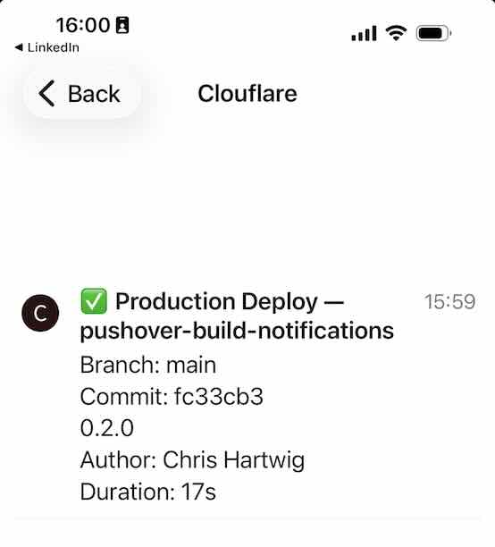

# Pushover Cloudflare Build Notifications

[](https://deploy.workers.cloudflare.com/?url=https://github.com/sslboard/pushover-cloudflare-build-notifications)

Push build notifications from Cloudflare Workers to your phone via [Pushover](https://pushover.net/). The worker reads build events from a Cloudflare Queue and sends them as push notifications with the right priority and sound, plus a link to the dashboard.

## Screenshot



## Features

- Push notifications for build success, failure, and cancellation
- Failed builds are high priority (bypasses quiet hours) with a siren sound
- Direct link to the build in the Cloudflare dashboard
- Build details: worker name, branch, commit, author, duration
- Two secrets to configure, nothing hardcoded

## How it works

```
┌─────────────────┐     ┌──────────────────────────┐     ┌──────────────────┐     ┌──────────┐
│ Workers Builds  │────▶│ Cloudflare Queue          │────▶│ This Worker      │────▶│ Pushover │
│ (any worker in  │     │ (event subscription)      │     │ (queue consumer) │     │ → Phone  │
│  your account)  │     │                            │     │                  │     │          │
└─────────────────┘     └──────────────────────────┘     └──────────────────┘     └──────────┘
```

1. A worker in your Cloudflare account triggers a build
2. Workers Builds publishes the event to your Cloudflare Queue via an event subscription
3. This worker picks up the event, formats it, and sends it to the Pushover API
4. Pushover delivers it to your phone

## Notification examples

| Build status | Priority | Sound | Notification |
|---|---|---|---|
| Succeeded | Normal (0) | `cashregister` | Branch, commit, message, author, duration + link |
| Failed | High (1, bypasses quiet hours) | `siren` | Branch, commit, trigger source + link |
| Cancelled | Low (-1, silent) | *(default)* | Branch, commit, author |

## Setup

### Prerequisites

- A [Pushover](https://pushover.net/) account with the app installed on at least one device (iOS, Android, or Desktop)
- A Cloudflare account with [Workers](https://developers.cloudflare.com/workers/) enabled

### Step 1: Create a Pushover application

1. Go to [pushover.net/apps/build](https://pushover.net/apps/build)
2. Name it (e.g. "Cloudflare Builds") and optionally upload an icon
3. Copy the API Token/Key (30 characters)

### Step 2: Note your Pushover user key

1. Go to your [Pushover dashboard](https://pushover.net/dashboard)
2. Copy your User Key (30 characters)

### Step 3: Deploy the worker

Click the button below to deploy via the Cloudflare dashboard:

[](https://deploy.workers.cloudflare.com/?url=https://github.com/sslboard/pushover-cloudflare-build-notifications)

Or deploy manually:

```bash
git clone https://github.com/sslboard/pushover-cloudflare-build-notifications.git
cd pushover-cloudflare-build-notifications
npm install
wrangler deploy
```

### Step 4: Create the queue

> The queue must exist before the worker can consume from it.

```bash
wrangler queues create builds-event-subscriptions
```

Or via the [Cloudflare Dashboard](https://dash.cloudflare.com/?to=/:account/workers/queues): Create Queue, name it `builds-event-subscriptions`.

### Step 5: Set secrets

```bash
wrangler secret put PUSHOVER_APP_TOKEN
# Paste your Pushover application API token

wrangler secret put PUSHOVER_USER_KEY
# Paste your Pushover user key
```

Or via the Cloudflare Dashboard: Workers → your worker → Settings → Variables and Secrets.

### Step 6: Create event subscriptions

Cloudflare event subscriptions are scoped to one worker per subscription. There is no wildcard option. You need to create a separate subscription for each worker you want to monitor.

At minimum, subscribe to the worker you just deployed so you get notifications when the notifier itself builds:

```bash
npx wrangler queues subscription create builds-event-subscriptions \
  --source workersBuilds.worker \
  --events build.succeeded,build.failed,build.canceled \
  --worker-name pushover-build-notifications
```

Then repeat for every other worker in your account. To list your workers:

```bash
# Via the Cloudflare API
account_id=$(npx wrangler whoami 2>&1 | grep -oP '[a-f0-9]{32}' | head -1)
curl -s "https://api.cloudflare.com/client/v4/accounts/$account_id/workers/scripts" \
  | python3 -c "import sys,json; [print(w['id']) for w in json.load(sys.stdin)['result']]"
```

Then create a subscription for each one:

```bash
for worker in worker-a worker-b worker-c; do
  npx wrangler queues subscription create builds-event-subscriptions \
    --source workersBuilds.worker \
    --events build.succeeded,build.failed,build.canceled \
    --worker-name "$worker"
done
```

Note: the event is `build.canceled` (one L), not `cancelled`.

To check what you have:

```bash
npx wrangler queues subscription list builds-event-subscriptions
```

To add a subscription for a new worker later:

```bash
npx wrangler queues subscription create builds-event-subscriptions \
  --source workersBuilds.worker \
  --events build.succeeded,build.failed,build.canceled \
  --worker-name <worker-name>
```

Or via the Cloudflare Dashboard: [Queues](https://dash.cloudflare.com/?to=/:account/workers/queues) → your queue → Subscriptions tab → Subscribe to events → source: Workers Builds → select events → Subscribe.

### Step 7: Test it

Push a commit to any worker in your account that has [Workers Builds](https://developers.cloudflare.com/workers/ci-cd/builds/) enabled. You should get a notification on your phone within seconds.

## Event types

| Event | Notification |
|---|---|
| `cf.workersBuilds.worker.build.succeeded` | Success notification with dashboard link |
| `cf.workersBuilds.worker.build.failed` | High-priority failure notification |
| `cf.workersBuilds.worker.build.failed` (cancelled) | Low-priority cancellation notice |
| `cf.workersBuilds.worker.build.started` | Skipped (no notification) |
| `cf.workersBuilds.worker.build.queued` | Skipped (no notification) |

## Event schema

Workers Builds events follow this structure (see [Cloudflare docs](https://developers.cloudflare.com/queues/event-subscriptions/events-schemas/#workers-builds)):

```json
{
  "type": "cf.workersBuilds.worker.build.succeeded",
  "source": {
    "type": "workersBuilds.worker",
    "workerName": "my-worker"
  },
  "payload": {
    "buildUuid": "build-12345678-90ab-cdef-1234-567890abcdef",
    "status": "success",
    "buildOutcome": "success",
    "createdAt": "2025-05-01T02:48:57.132Z",
    "stoppedAt": "2025-05-01T02:50:15.132Z",
    "buildTriggerMetadata": {
      "buildTriggerSource": "push_event",
      "branch": "main",
      "commitHash": "abc123def456",
      "commitMessage": "Fix bug in authentication",
      "author": "developer@example.com",
      "repoName": "my-worker-repo",
      "providerAccountName": "github-user",
      "providerType": "github"
    }
  },
  "metadata": {
    "accountId": "your-account-id",
    "eventSubscriptionId": "sub-1234",
    "eventSchemaVersion": 1,
    "eventTimestamp": "2025-05-01T02:48:57.132Z"
  }
}
```

## Configuration

### Secrets

| Secret | Description |
|---|---|
| `PUSHOVER_APP_TOKEN` | Your Pushover application API token |
| `PUSHOVER_USER_KEY` | Your Pushover user key |

### Queue settings (wrangler.jsonc)

| Setting | Default | Description |
|---|---|---|
| `max_batch_size` | 10 | Messages processed per batch |
| `max_batch_timeout` | 30 | Seconds to wait for a full batch |
| `max_retries` | 3 | Retry attempts for failed processing |

## Development

```bash
# Install dependencies
npm install

# Generate types (do NOT install @cloudflare/workers-types)
npx wrangler types

# Run tests
npm test

# Run tests in watch mode
npm run test:watch

# Local development
npm run dev

# View live logs
npm run tail
```

## Troubleshooting

### No notifications appearing

1. Check the queue: [Dashboard → Queues](https://dash.cloudflare.com/?to=/:account/workers/queues) → your queue. Are messages arriving?
2. Check worker logs: Dashboard → Workers → your worker → Logs
3. Check the subscription: Queues → your queue → Subscriptions tab
4. Check secrets: Workers → your worker → Settings → Variables and Secrets

### Deploy fails with "Queue does not exist"

Create the queue first (see [Step 4](#step-4-create-the-queue)).

### Pushover returns "invalid token"

- Check that `PUSHOVER_APP_TOKEN` is the application token from [pushover.net/apps](https://pushover.net/apps), not your user key
- Check that `PUSHOVER_USER_KEY` is from your [dashboard](https://pushover.net/dashboard)

### Build events not appearing in the queue

- Make sure [Workers Builds](https://developers.cloudflare.com/workers/ci-cd/builds/) is enabled on the worker in question
- Each worker needs its own subscription. Run `npx wrangler queues subscription list builds-event-subscriptions` and check that the worker appears under the Resource column
- Make sure the subscription includes the event types you want (at minimum `build.succeeded` and `build.failed`, plus `build.canceled` for cancellations)

## Learn more

- [Pushover Message API](https://pushover.net/api)
- [Cloudflare Queue Event Subscriptions](https://developers.cloudflare.com/queues/event-subscriptions/)
- [Workers Builds](https://developers.cloudflare.com/workers/ci-cd/builds/)
- [Workers Builds Event Schema](https://developers.cloudflare.com/queues/event-subscriptions/events-schemas/#workers-builds)
- [Cloudflare Queues](https://developers.cloudflare.com/queues/)

## About

Built by [SSLBoard](https://sslboard.com/). Type a domain, get a TLS audit in minutes. No agents, no account required.

## License

MIT
